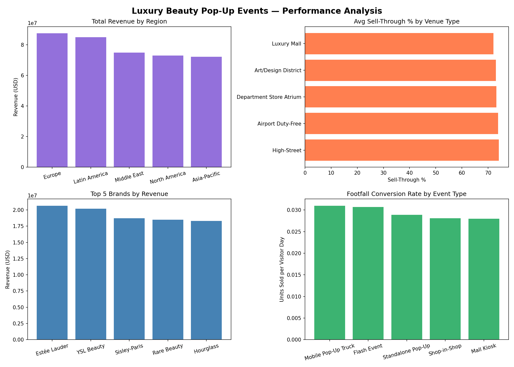
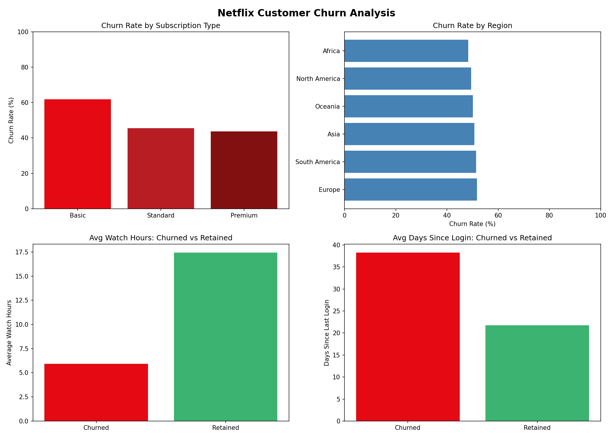

# Data Analytics Portfolio
### Divyasree Uppalapati

Analyst working in SQL and Python, with a background in security and cloud data. Each project below goes from raw data to cleaned analysis, charts, and recommendations, and every number here comes straight from the notebook outputs.

---

## Projects

### 1. Luxury Beauty Cosmetics Pop-Up Events Analysis
**Tools:** Python, SQL (SQLite), pandas, matplotlib, Jupyter Notebook  
**Dataset:** 2,133 luxury beauty pop-up events across 5 global regions  

**Key Findings:**
- Europe leads on both total revenue ($89.0M) and revenue per event ($208K), about 10% more per event than Latin America, the next-best region
- Latin America's total is close ($86.5M), but mostly because it ran more events (459 vs. 428)
- Venue type and event format barely change results: sell-through varies by only about 2 percentage points across venues, so region is the lever that matters

📁 [View Project](./01-retail-sales-analysis)

---

### 2. Netflix Customer Churn Analysis
**Tools:** Python, SQL (SQLite), pandas, seaborn, scikit-learn, Jupyter Notebook  
**Dataset:** 5,000 customer records with subscription and engagement data (public practice dataset)  

**Key Findings:**
- Basic plan subscribers churn at 61.83%, 16 to 18 percentage points higher than Standard and Premium
- Churned customers average only 5.92 watch hours vs. 17.45 for retained customers
- A logistic regression model predicts churn with 88.0% accuracy against a 50.2% baseline, catching 89% of customers who actually churned

📁 [View Project](./02-netflix-churn-analysis)

---

## Skills
Python · SQL · pandas · matplotlib · seaborn · scikit-learn · SQLite · Jupyter Notebook
